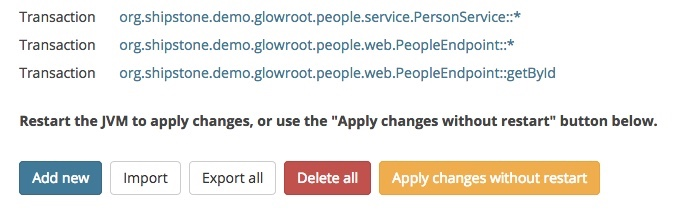

### Instrumentation

-@@-

Informations en plus ?

notes:

Qu'est ce que l'instrumentation

-@@-

Classes

Méthodes<!-- .element class="fragment" -->

Paramètres<!-- .element class="fragment" -->

Resultat en retour<!-- .element class="fragment" -->

notes:

Ajouter des information sur...

-@@-

### 2 possibilités

Dans le code `Inline`<!-- .element class="fragment" -->

Via l'agent et sa configuration<!-- .element class="fragment" -->

notes:

Instrumentation as a code

ou configuration

-@-

### Instrumentation - `Inline`

```xml
<dependency>
  <groupId>org.glowroot</groupId>
  <artifactId>glowroot-agent-api</artifactId>
  <version>0.11.1</version>
</dependency>
```

Ajout d'une dependance

-@@-

### `Inline` - annotation

```java
@Instrumentation.Timer("person byId")
public Person getPersonById(
    final Long personId
) throws PersonNotFouncException {
  return personRepository.
    findById(personId).orElseThrow(
        () -> new PersonNotFouncException(personId)
    );
}
```

notes:

La manière basique

-@@-

### `Inline` - annotation

```java
@Instrumentation.TraceEntry(message = "person id: {{0}}",
  timer = "person getId")
public Person getPersonById(
    final Long personId
) throws PersonNotFouncException {
  return personRepository
    .findById(personId)
    .orElseThrow(
        () -> new PersonNotFouncException(personId)
    );
}
```

notes:

affichage des informations avec les paramètres...

... mais si paramètre == object alors affichage du pointeur

-@@-

### `Inline` - annotation

```java
@Instrumentation.TraceEntry(
    message = "person.login: {{0.login}}",
    timer = "person create")
public Person createPerson(Person person) {
  person.setId(null);
  return personRepository.save(person);
}
```

notes:

Possibilité d'acceder à des donnée par introspection

-@@-

### `Inline`

***Problème*** <!-- .element style="color: crimson;" -->

**Adhérence**<!-- .element class="fragment" -->

notes:

Le code est fortement lié à Glowroot et sera transmis d'environement a environement

-@-

### Instrumentation - Configuration

<!-- .element class="fragment" -->

notes:

La cofiguration accessible via le menu configuration

-@@-

### Instrumentation - Configuration

Utiliser l'introspection au runtime

*package*<!-- .element class="fragment" -->

*classe*<!-- .element class="fragment" -->

*méthode*<!-- .element class="fragment" -->

notes:

Permet différent niveau d'intrumentation, mais cela entraine des effets de bord

-@@-

### Instrumentation - Configuration


Toutes les méthodes

notes:

Instrumentation des toutes les méthode d'une classe

-@@-

### Instrumentation - Configuration


Toutes une méthode

notes:

plus spécifiquement d'une méthode d'une classe

-@@-

### Instrumentation - Configuration

Deux choix non exclusif, mais...

<!-- .element class="fragment" -->

notes:

les deux timer/instrumentation se chevauchent

-@@-

### Instrumentation - Configuration

Vue d'aggregation

Nom de la transaction

pattern de capture

Nom du timer

*Le tout servi par une aide propre*<!-- .element class="fragment" -->

notes:

Element additionel

-@@-

### Instrumentation - Configuration

Rechargement a chaud possible



notes:

Permet une activation direct de l'instrumentation

-@@-

### Instrumentation - Configuration

exportation

```json
{
  "className": "org.shipstone.demo.glowroot.people.web.PeopleEndpoint",
  "methodName": "getById",
  "methodParameterTypes": [
    ".."
  ],
  "captureKind": "transaction",
  "transactionType": "Web",
  "transactionNameTemplate": "personEndpoint",
  "alreadyInTransactionBehavior": "capture-trace-entry",
  "traceEntryMessageTemplate": "{{this}}.{{methodName}}( {{0}} ) => {{_}}",
  "timerName": "personTimer"
}
```

notes:

permet ne sauvegarde des instrumentations significative

Au sein du projet, pourquoi pas ?

-@@-

# Démo

