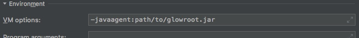

### mode autonome

expose un web serveur sur le port 4000

*En dev, sans mode debug (pleine vitesse)*

*En integ, lors des validations MOE pour remonter les hotspots*<!-- .element class="fragment fade-out" -->

notes:

En integ, mieux vaux privilégier le mode connecté.

-@@-

### mode autonome

***En parametre de la JVM***

```
java -javaagent:path/to/glowroot.jar -jar superApp.jar
```

<!-- .element class="fragment" -->

notes:
sous Intellij, exemple de configuration de d'execution

java -javaagent:../../glowroot/glowroot.jar -jar people-0.0.1-SNAPSHOT.jar

aide glowroot : [](https://github.com/glowroot/glowroot/wiki/Where-are-my-application-server%27s-JVM-args%3F#spring-boot)

-@@-

# Démo

-@-

## Et dans la vrai vie ?

-@@-

## Glowroot & AVISé

-@@-


notes:

Vue générale

A noter, le pic JDBC

-@@-


notes:

Listes des requetes les + longues

-@@-


notes:

et les slowtrace (overhead < 10 ms pour la démo)

-@@-


notes:

Les requêtes

La requête INFNITE qui prends pas mal de temps

A remarquer, temps total & moyen

-@@-


notes:

les appel HTTP

A remarquer, temps total & moyen

-@@-


notes:

un appel en détail

permet de voi le différent temps totaux

Cout du logging

-@@-


notes:

Le détail des différentes étapes

Permet de visualiser sans ambiguité les SPOF

-@@-


notes:

Visualisation d'un requête JDBC avec les paramètres

-@@-


notes:

L'ensemble des requêtes SQL
