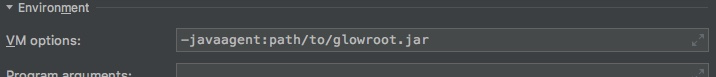
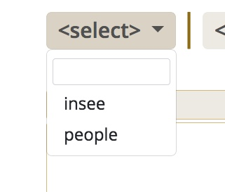

### mode connecté

Connexion a un serveur distant

Suivre l'execution de plusieurs applications

-@@-

### mode connecté

***En parametre de la JVM***

```
java -javaagent:path/to/glowroot.jar -jar superApp.jar
```

<!-- .element class="fragment" -->

***mais...***<!-- .element class="fragment" -->

notes:
sous Intellij, exemple de configuration de d'execution

java -javaagent:../../glowroot/glowroot.jar -jar people-0.0.1-SNAPSHOT.jar

aide glowroot : [](https://github.com/glowroot/glowroot/wiki/Where-are-my-application-server%27s-JVM-args%3F#spring-boot)

-@@-

### mode connecté

Dans le repertoire de l'agent

Ajout du fichier `glowroot.properties`

```
agent.id=insee
collector.address=http://localhost:8181
```

-@@-

### mode connecté

Dans le repertoire de l'agent

Ajout du fichier `glowroot.properties`

```
agent.id=people
collector.address=http://localhost:8181
```

-@@-

### mode connecté

Les applications sont selectionnable



-@@-

# Démo

